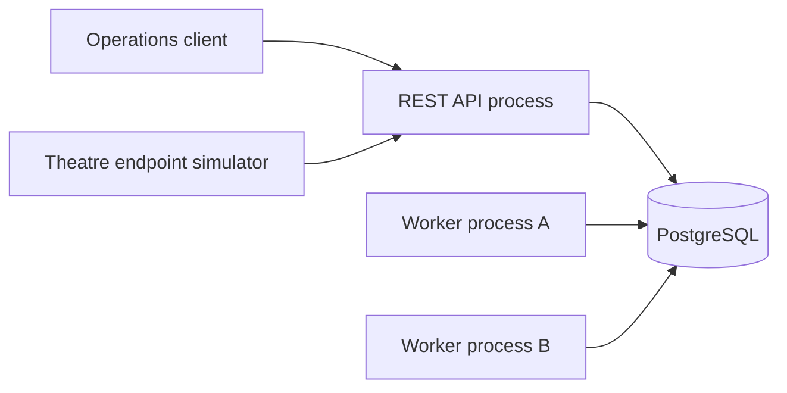

# Architecture

## Components

The API validates requests, authorizes `/v1/` routes, writes domain records, and exposes health and metrics. The worker independently polls PostgreSQL and simulates delivery. PostgreSQL is the durable queue and source of truth. No broker or real cinema content service exists yet.

## Data model

- `theatres`: immutable ID and unique endpoint identifier, location, operational status, timestamps.
- `releases`: unique `(content_identifier, version)`, release date, status, JSON metadata, timestamps.
- `distribution_jobs`: unique `(release_id, theatre_id)`, state, attempts, scheduling time, lease owner and expiry, processing/completion timestamps, failure reason.
- `job_events`: append-only transition history, reason, worker owner, timestamp.
- `theatre_heartbeats`: append-only reports with both reported and server receive time. Readiness uses the latest **received** report and a configured staleness threshold.

Foreign keys prevent orphan jobs and heartbeats. Partial indexes support due-job claims and expired-lease scans. A lateral lookup using `(theatre_id, received_at DESC, id DESC)` gets the latest heartbeat per theatre. PostgreSQL constraints enforce allowed state values and processing lease fields; application transactions enforce transitions.

## Job flow and concurrency

```mermaid
stateDiagram-v2
  [*] --> PENDING
  PENDING --> PROCESSING: claim
  RETRYING --> PROCESSING: claim when due
  PROCESSING --> DELIVERED: success
  PROCESSING --> RETRYING: transient failure or expired lease; attempts remain
  PROCESSING --> FAILED: attempts exhausted
  FAILED --> RETRYING: explicit manual retry; attempts reset
```

Scheduling inserts jobs and initial events in one transaction. Each worker claim uses `SELECT ... FOR UPDATE SKIP LOCKED` inside a transaction, updates the selected rows to `PROCESSING`, increments attempts, assigns a worker ID and lease expiry, and records events before commit. Competing workers cannot claim the same selected row simultaneously. Completion uses a conditional update requiring state, worker owner, attempt number, and an unexpired lease. A stale worker cannot commit success after a lease has been recovered. Workers recover expired leases to `RETRYING` or `FAILED`. Automatic retry uses capped exponential delay. A terminal failed job requires explicit operator retry.

The worker waits for active handlers during graceful shutdown. An interrupted delivery retains its processing state until the lease expires; another worker can recover it. Processing is simulated and has no external side effect. Future real delivery must define idempotency before assuming retries are safe. Lease renewal is not implemented: configure a lease longer than the maximum expected processing time.

## Failure and observability

API readiness queries PostgreSQL; liveness does not. Development simulation can force readiness failure, DB operation delay, slow delivery, and transient delivery errors. Production config rejects active simulation. API logs request IDs and correlation IDs. Worker logs job IDs, attempts, and outcomes. API `/metrics` exposes process and HTTP measurements plus live database job-state counts. Worker `/metrics` on its configured port exposes worker activity and outcomes.

## Security boundaries and limitations

Inputs are validated and SQL is parameterized. Production requires an API key for `/v1/` endpoints. This is a single shared key, not user identity or role-based authorization. `/health/*` and both `/metrics` listeners are public at the application layer. Transport encryption, external authentication, network controls, credential distribution, backup, and access policy are operational decisions. There is no content transfer integration, outbox, queue broker, pagination total count, or heartbeat retention policy. API process startup requires PostgreSQL even though liveness itself does not query it.
